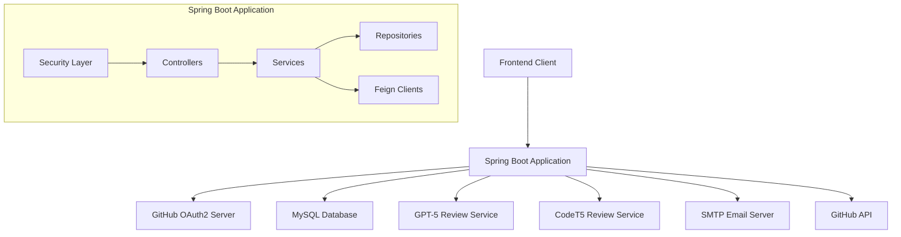

# CodeRover 🚀

[](https://github.com/DamianRavinduPeiris/coderover-spring-web)
[](https://openjdk.org/projects/jdk/21/)
[](https://spring.io/projects/spring-boot)
[](LICENSE)

**CodeRover** is a powerful Spring Boot web application that revolutionizes code review processes by integrating AI-powered analysis with GitHub repository management. It provides seamless OAuth2 authentication, intelligent code review capabilities, and comprehensive repository exploration tools.

## 🌟 Features

### 🔐 Authentication & Security
- **GitHub OAuth2 Integration**: Secure authentication using GitHub credentials
- **JWT Token Management**: Stateless authentication with JSON Web Tokens
- **Spring Security**: Enterprise-grade security configuration
- **CORS Support**: Cross-origin resource sharing for frontend integration

### 🤖 AI-Powered Code Review
- **GPT-5 Integration**: Advanced code analysis using OpenAI's latest model
- **CodeT5 Support**: Alternative AI model for code review and suggestions
- **Build Review**: Specialized review for build scripts and configuration files
- **RESTful API**: Easy integration with development workflows

### 🔧 GitHub Integration
- **Repository Management**: Browse and access user repositories
- **File System Navigation**: Explore repository trees and file contents
- **Branch Management**: View and manage repository branches
- **Blob Access**: Direct access to file contents and metadata

### 📊 User Management
- **Profile Management**: Store and manage user GitHub profile information
- **Repository Statistics**: Track public/private repositories, followers, etc.
- **Email Integration**: Send reports and notifications via SMTP

### 🚀 DevOps & Deployment
- **Docker Support**: Multi-stage Docker builds for production deployment
- **Health Checks**: Built-in health monitoring endpoints
- **CI/CD Integration**: GitHub Actions workflow for automated testing and deployment
- **Code Coverage**: JaCoCo integration for comprehensive test coverage

## 🏗️ Technology Stack

| Category | Technology |
|----------|------------|
| **Framework** | Spring Boot 3.5.0, Spring Security, Spring Data JPA |
| **Language** | Java 21 |
| **Database** | MySQL 8+ |
| **Authentication** | OAuth2 (GitHub), JWT |
| **HTTP Client** | OpenFeign |
| **Build Tool** | Maven |
| **Testing** | JUnit 5, Mockito, AssertJ |
| **Code Coverage** | JaCoCo |
| **Containerization** | Docker |
| **Email** | Spring Mail with SMTP |

## 📋 Prerequisites

- **Java 21** or higher
- **Maven 3.6+** 
- **MySQL 8.0+** database
- **Docker** (optional, for containerized deployment)
- **GitHub OAuth App** (for authentication)

## 🚀 Quick Start

### 1. Clone the Repository

```bash
git clone https://github.com/DamianRavinduPeiris/coderover-spring-web.git
cd coderover-spring-web
```

### 2. Set Up GitHub OAuth Application

1. Go to [GitHub Developer Settings](https://github.com/settings/developers)
2. Create a new OAuth App
3. Set Authorization callback URL to: `http://localhost:8080/login/oauth2/code/github`
4. Note down the **Client ID** and **Client Secret**

### 3. Configure Environment Variables

Create a `.env` file or set the following environment variables:

```bash
# GitHub OAuth
GITHUB_CLIENT_ID=your_github_client_id
GITHUB_CLIENT_SECRET=your_github_client_secret

# Database Configuration
DB_URL=jdbc:mysql://localhost:3306/coderover
DB_USERNAME=your_db_username
DB_PASSWORD=your_db_password

# JWT Configuration
JWT_SECRET=your_jwt_secret_key

# Review Service Configuration
REVIEW_CLIENT_BASE_URL=https://your-review-service-url
REVIEW_CLIENT_TOKEN=your_review_service_token
REVIEW_CLIENT_PROMPT=your_review_prompt
REVIEW_CLIENT_BUILD_PROMPT=your_build_review_prompt

# CodeT5 Configuration
CODE_T5_V1_BASE_URL=https://your-codet5-service-url

# Email Configuration
MAIL_HOST=smtp.gmail.com
APP_USERNAME=your_email@gmail.com
APP_PASSWORD=your_app_password
MAIL_FROM=your_email@gmail.com

# Frontend Configuration
FRONTEND_REDIRECT_URI=http://localhost:3000

# User Configuration
USER_DEFAULT_PROFILE_PICTURE_URL=https://github.com/identicons/default.png
```

### 4. Set Up Database

```sql
CREATE DATABASE coderover;
CREATE USER 'coderover_user'@'localhost' IDENTIFIED BY 'password';
GRANT ALL PRIVILEGES ON coderover.* TO 'coderover_user'@'localhost';
FLUSH PRIVILEGES;
```

### 5. Build and Run

```bash
# Using Maven
mvn clean package -DskipTests
java -jar target/coderover-0.0.1-SNAPSHOT.jar

# Or using Maven Spring Boot plugin
mvn spring-boot:run
```

The application will be available at `http://localhost:8080`

## 🐳 Docker Deployment

### Build Docker Image

```bash
docker build -t coderover:latest .
```

### Run with Docker Compose

Create a `docker-compose.yml`:

```yaml
version: '3.8'
services:
  app:
    image: coderover:latest
    ports:
      - "8080:8080"
    environment:
      - SPRING_PROFILES_ACTIVE=prod
      - GITHUB_CLIENT_ID=${GITHUB_CLIENT_ID}
      - GITHUB_CLIENT_SECRET=${GITHUB_CLIENT_SECRET}
      - DB_URL=jdbc:mysql://db:3306/coderover
      - DB_USERNAME=coderover
      - DB_PASSWORD=password
    depends_on:
      - db
      
  db:
    image: mysql:8.0
    environment:
      - MYSQL_DATABASE=coderover
      - MYSQL_USER=coderover
      - MYSQL_PASSWORD=password
      - MYSQL_ROOT_PASSWORD=rootpassword
    volumes:
      - mysql_data:/var/lib/mysql
    ports:
      - "3306:3306"

volumes:
  mysql_data:
```

```bash
docker-compose up -d
```

## 📚 API Documentation

### Authentication Endpoints

| Method | Endpoint | Description |
|--------|----------|-------------|
| GET | `/oauth2/authorization/github` | Initiate GitHub OAuth flow |
| GET | `/login/oauth2/code/github` | OAuth callback endpoint |
| GET | `/api/v1/github/user` | Get authenticated user info |

### GitHub Integration

| Method | Endpoint | Description |
|--------|----------|-------------|
| GET | `/api/v1/github/user/repos` | Fetch user repositories |
| GET | `/api/v1/github/repos/{owner}/{repo}/tree` | Get repository file tree |
| GET | `/api/v1/github/repos/{owner}/{repo}/blob` | Get file content |
| GET | `/api/v1/github/repos/{owner}/{repo}` | Get all branches |

### Code Review

| Method | Endpoint | Description |
|--------|----------|-------------|
| POST | `/api/v1/review` | Request code review |
| POST | `/api/v1/review/codeT5/v1` | Request CodeT5 review |
| POST | `/api/v1/review/status` | Review build status |

### Health Monitoring

| Method | Endpoint | Description |
|--------|----------|-------------|
| GET | `/health` | Basic health check |
| GET | `/actuator/health` | Detailed health information |

## 🧪 Testing

Run the test suite:

```bash
# Run all tests
mvn test

# Run tests with coverage
mvn clean test jacoco:report

# View coverage report
open target/site/jacoco/index.html
```

## 🔧 Development

### Project Structure

```
src/
├── main/java/com/damian/coderover/
│   ├── config/          # Configuration classes
│   ├── controller/      # REST controllers
│   ├── dto/            # Data transfer objects
│   ├── entity/         # JPA entities
│   ├── exception/      # Custom exceptions
│   ├── feign/          # Feign clients
│   ├── filter/         # Security filters
│   ├── handler/        # Event handlers
│   ├── repository/     # Data repositories
│   ├── response/       # Response models
│   ├── service/        # Business logic
│   └── util/           # Utility classes
├── main/resources/
│   └── application.yml # Configuration file
└── tests/java/         # Test classes
```

### Code Style and Standards

- Follow Java naming conventions
- Use Lombok for boilerplate reduction
- Implement comprehensive unit tests
- Maintain minimum 80% code coverage
- Use meaningful commit messages

### Contributing

1. Fork the repository
2. Create a feature branch (`git checkout -b feature/amazing-feature`)
3. Commit your changes (`git commit -m 'Add amazing feature'`)
4. Push to the branch (`git push origin feature/amazing-feature`)
5. Open a Pull Request

## 🔍 Troubleshooting

### Common Issues

**Issue**: `java.lang.UnsupportedClassVersionError`
**Solution**: Ensure you're using Java 21 or higher

**Issue**: Database connection failures
**Solution**: Verify MySQL is running and credentials are correct

**Issue**: OAuth authentication failures
**Solution**: Check GitHub OAuth app configuration and callback URLs

**Issue**: Review API timeouts
**Solution**: Verify review service endpoints and authentication tokens

### Logs and Debugging

Enable debug logging in `application.yml`:

```yaml
logging:
  level:
    com.damian.coderover: DEBUG
    org.springframework.security: DEBUG
```

## 📊 Monitoring and Metrics

### Health Checks

The application includes built-in health checks:

- Database connectivity
- External service availability
- Memory and disk usage

Access health information at `/actuator/health`

### Code Coverage

View test coverage reports after running:

```bash
mvn clean test jacoco:report
```

Reports are generated in `target/site/jacoco/`

## 🚀 Deployment

### Local Development

```bash
mvn spring-boot:run -Dspring-boot.run.profiles=dev
```

### Production Deployment

```bash
# Build optimized JAR
mvn clean package -Pprod -DskipTests

# Run with production profile
java -jar -Dspring.profiles.active=prod target/coderover-0.0.1-SNAPSHOT.jar
```

### Docker Production

```bash
# Build and push to registry
docker build -t your-registry/coderover:latest .
docker push your-registry/coderover:latest

# Deploy
docker run -d \
  --name coderover \
  -p 8080:8080 \
  -e SPRING_PROFILES_ACTIVE=prod \
  your-registry/coderover:latest
```

## 🌍 Environment Profiles

### Development Profile

**application-dev.yml**
```yaml
logging:
  level:
    com.damian.coderover: DEBUG
    org.springframework.security: DEBUG
spring:
  jpa:
    show-sql: true
  mail:
    properties:
      mail:
        debug: true
```

### Production Profile

**application-prod.yml**
```yaml
logging:
  level:
    com.damian.coderover: INFO
    org.springframework.security: WARN
spring:
  jpa:
    show-sql: false
  mail:
    properties:
      mail:
        debug: false
```

### Testing Profile

**application-test.yml**
```yaml
spring:
  datasource:
    url: jdbc:h2:mem:testdb
    username: sa
    password: password
  jpa:
    hibernate:
      ddl-auto: create-drop
```

## 🤝 Support

For support and questions:

- 📧 Email: [damianravindu@gmail.com](mailto:damianravindu@gmail.com)
- 🐛 Issues: [GitHub Issues](https://github.com/DamianRavinduPeiris/coderover-spring-web/issues)
- 💬 Discussions: [GitHub Discussions](https://github.com/DamianRavinduPeiris/coderover-spring-web/discussions)

## 📄 License

This project is licensed under the MIT License - see the [LICENSE](LICENSE) file for details.

## 📈 Architecture Overview



### Key Components

- **Security Layer**: JWT + OAuth2 authentication
- **Controllers**: RESTful API endpoints
- **Services**: Business logic implementation  
- **Repositories**: Data access layer
- **Feign Clients**: External API communication

## 📝 Sample API Usage

### Authentication Flow

```bash
# 1. Initiate GitHub OAuth
curl -X GET http://localhost:8080/oauth2/authorization/github

# 2. After successful authentication, use JWT token
curl -X GET \
  -H "Authorization: Bearer your-jwt-token" \
  http://localhost:8080/api/v1/github/user
```

### Code Review Example

```bash
curl -X POST \
  -H "Content-Type: application/json" \
  -H "Authorization: Bearer your-jwt-token" \
  -d '{"code": "public class Example { public static void main(String[] args) { System.out.println(\"Hello World\"); } }"}' \
  http://localhost:8080/api/v1/review
```

### Repository Tree Example

```bash
curl -X GET \
  -H "Authorization: Bearer your-jwt-token" \
  "http://localhost:8080/api/v1/github/repos/owner/repo/tree?branch=main"
```

## ⚡ Performance & Optimization

### JVM Tuning

For production deployment, consider these JVM options:

```bash
java -jar \
  -Xms512m -Xmx2g \
  -XX:+UseG1GC \
  -XX:MaxGCPauseMillis=200 \
  -XX:+HeapDumpOnOutOfMemoryError \
  target/coderover-0.0.1-SNAPSHOT.jar
```

### Database Optimization

- **Connection Pooling**: HikariCP is configured by default
- **Indexing**: Add indexes on frequently queried fields
- **Query Optimization**: Use `@Query` annotations for complex queries

### Caching Strategy

Consider implementing caching for:
- GitHub API responses
- User profile data
- Review results

### Monitoring

Use Spring Boot Actuator endpoints for monitoring:
- `/actuator/metrics` - Application metrics
- `/actuator/health` - Health checks
- `/actuator/env` - Environment information

## 🔐 Security Best Practices

### JWT Security

- Use strong secret keys (minimum 256 bits)
- Set appropriate token expiration times
- Implement token refresh mechanism
- Store tokens securely on client side

### Database Security

```yaml
spring:
  datasource:
    url: jdbc:mysql://localhost:3306/coderover?useSSL=true&requireSSL=true
    username: ${DB_USERNAME}
    password: ${DB_PASSWORD}
```

### Environment Variables

Always use environment variables for sensitive data:
- Never commit secrets to version control
- Use different configurations for different environments
- Validate all environment variables at startup

## 🔧 Configuration Details

### Security Configuration

The application uses a multi-layered security approach:

- **OAuth2**: GitHub integration for user authentication
- **JWT**: Stateless token-based authentication
- **CORS**: Configurable cross-origin resource sharing
- **Method Security**: Endpoint-level authorization

### Database Configuration

Supports MySQL with automatic schema generation:

```yaml
spring:
  jpa:
    hibernate:
      ddl-auto: update  # Creates tables automatically
    show-sql: true      # Enable SQL logging in development
```

### External Services

The application integrates with multiple external services:

| Service | Purpose | Configuration |
|---------|---------|---------------|
| GitHub API | Repository access and OAuth | `github.base-uri` |
| GPT-5 API | Advanced code review | `review.client.*` |
| CodeT5 API | Alternative code review | `codeT5.base-url` |
| SMTP Server | Email notifications | `spring.mail.*` |

## 🙏 Acknowledgments

- Spring Boot team for the excellent framework
- GitHub for OAuth2 integration
- OpenAI for GPT-5 API
- CodeT5 team for the alternative review model
- Contributors and community members

---

⭐ **Star this repository if you find it useful!**

Made with ❤️ by [Damian Ravindu Peiris](https://github.com/DamianRavinduPeiris)